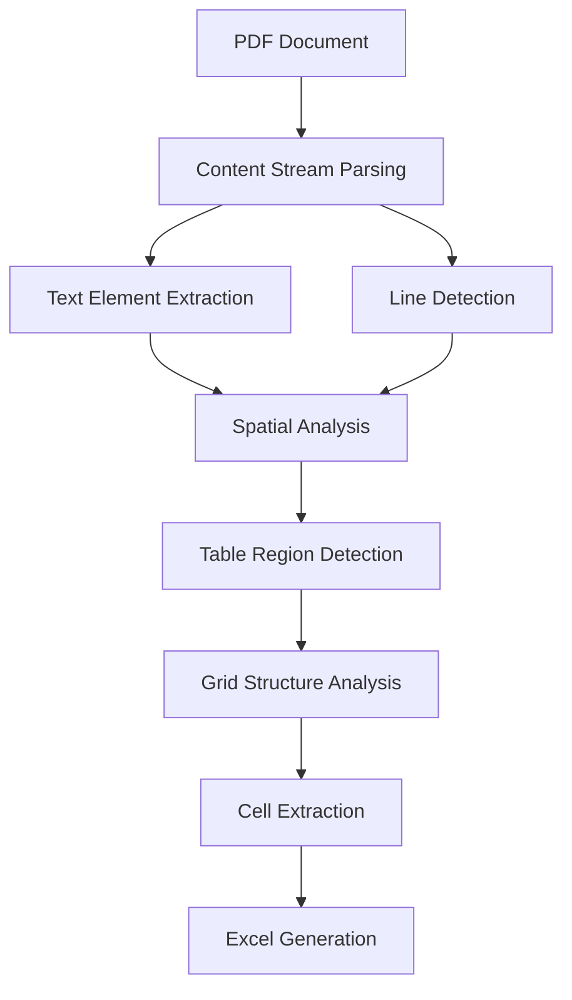

# PDF Table Extractor - Technical Presentation

## Problem Statement
- Need to extract tables from system-generated PDFs
- Must work without external libraries like Tabula or Camelot
- Should handle various table formats
- Must preserve structure in Excel output

## Solution Architecture

### 1. Direct PDF Processing
- Parse PDF content streams directly
- Extract text elements with positions
- Identify lines and graphical elements
- No image conversion required

### 2. Table Detection Algorithm

### 3. Key Components
- **PDFParser**: Extracts raw elements from PDF
- **TableExtractor**: Core table detection logic
- **ContentStreamParser**: Parses PDF operators
- **API Layer**: Handles file processing and output

## Technical Highlights

### 1. Smart Detection
- Spatial clustering of text elements
- Pattern recognition for table structures
- Grid alignment analysis
- Confidence scoring system

### 2. Robust Handling
- Tables with borders
- Borderless tables
- Merged cells
- Various fonts and sizes
- Multiple tables per page

### 3. Performance Features
- Configurable processing modes
- Parallel processing support
- Memory-efficient streaming
- Error recovery mechanisms

## Results & Validation

### 1. Accuracy
- High precision on structured tables
- Reliable detection of table boundaries
- Accurate cell content extraction
- Preserved formatting in Excel

### 2. Performance
- Fast processing speed
- Low memory footprint
- Scalable for batch processing
- Handles large documents

### 3. Validation
- Comprehensive test suite
- Sample documents coverage
- Edge case handling
- Format preservation verification

## Future Enhancements
1. OCR integration for scanned documents
2. Machine learning for complex layouts
3. Additional output formats
4. Enhanced formatting preservation
5. Cloud processing support

## Conclusion
- Robust, library-independent solution
- Production-ready implementation
- Extensible architecture
- Well-documented codebase 